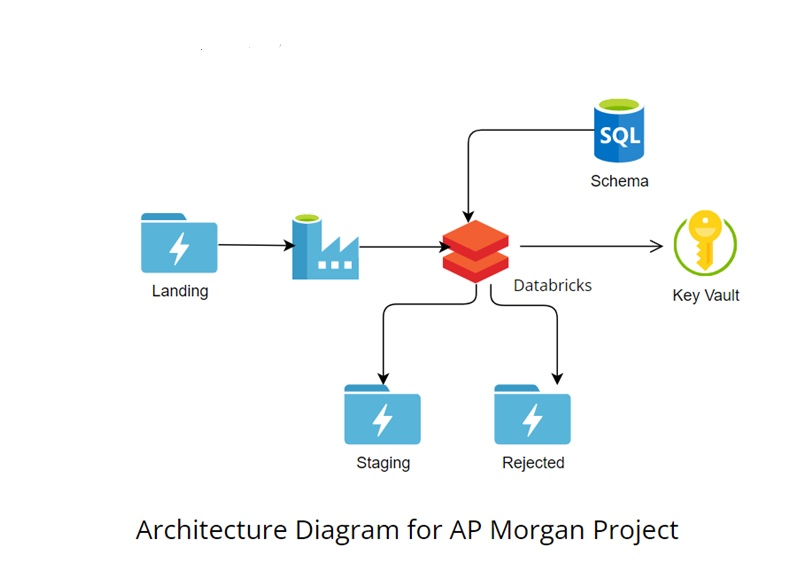

# DataFilteringPorject

### Objective
* To develop a solution that will filter files that fails the doesn't match the required schema.

### Tools Used
* Storage : Adls Gen 2
* Server : Sql Server
* Warehouse : Azure Data Factory , Azure Databricks
* Credeintials Storage : Azure Key Vault

### Solution Artitecture

